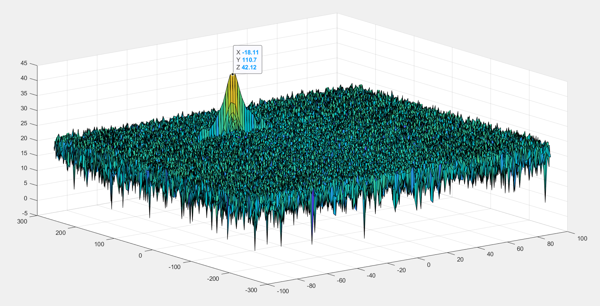

# Radar Target Generation and Detection

This project uses Matlab to introduce frequency modulated continuous-wave (FMCW) radar and related post-processing techniques. The topics covered include:
- Fast Fourier transforms (FFT) and 2D FFT(Range Doppler Grid)
- Clutter v. target discrimination
- Sizing chirp bandwith to meet system requirements for range resolution
- Constant false alarm rate (CFAR) noise suppression and its varient CA-CFAR
- Signal-to-noise ratio (SNR) and dynamic thresholding

## Visualization of the results




## Installing Matlab
Instructions for installing the latest version of Matlab can be found at https://www.mathworks.com/

## Project writeup

### FMCW Waveform Design
Using the given system requirements, design a FMCW waveform. Find its Bandwidth (B), chirp time (Tchirp) and slope of the chirp.

%% Radar Specifications 
%%%%%%%%%%%%%%%%%%%%%%%%%%%
% Frequency of operation = 77GHz
% Max Range = 200m
% Range Resolution = 1 m
% Max Velocity = 100 m/s
%%%%%%%%%%%%%%%%%%%%%%%%%%%

fc= 77e9;             %carrier freq
d_res = 1;
c = 3*10^8;
RMax = 200;

B = c / (2 * rangeResolution);
Tchirp = rttScale * (2 * maxRange / c);  % scale factor on round-trip time 
slope =  B / Tchirp;

% The number of chirps in one sequence. It's ideal to have 2^value for ease
% of running FFT for Doppler estimation. 
Nd = 128;  % # of doppler cells OR # of sent periods % number of chirps

% The number of samples on each chirp. 
Nr = 1024;  % for length of time OR # of range cells

% Timestamp for running the displacement scenario for every sample.
t = linspace(0, Nd * Tchirp, Nr * Nd); % total time for samples
L = Nr * Nd;

% Creating vectors for Tx, Rx, and Mix based on the total samples input.
Tx = zeros(1, length(t));  % transmitted signal
Rx = zeros(1, length(t));  % received signal
Mix = zeros(1, length(t));  % beat signal

### Signal generation and moving target simulation

% For each time stamp update the range of the target for constant velocity. 
for i = 1:length(t)

    % Time delay for round trip on this iteration, given constant velocity.
    tau = (R + t(i) * v) / c;  % seconds
    
    % For each sample we need update the transmitted and received signal. 
    Tx(i) = cos(2 * pi * (fc * t(i) + slope * t(i)^2 / 2));
    Rx(i) = cos(2 * pi * (fc * (t(i) - tau) + slope * (t(i) - tau)^2 / 2));
    
    % Now by mixing the transmit and receive, generate the beat signal by
    % element-wise matrix multiplication of the tx/rx signals.
    Mix(i) = Tx(i) * Rx(i);
end

### Implementation steps for the 2D CFAR process
_Lines 131-198 in script Radar_Target_Generation_and_Detection.m_

The 2D constant false alarm rate (CFAR), when applied to the results of the 2D FFT, uses a dynamic threshold set by the noise level in the vicinity of the cell under test (CUT). The key steps are as follows:
1. Loop over all cells in the range and doppler dimensions, starting and ending at indices which leave appropriate margins
2. Slice the training cells (and exclude the guard cells) surrounding the CUT
3. Convert the training cell values from decibels (dB) to power, to linearize
4. Find the mean noise level among the training cells
5. Convert this average value back from power to dB
6. Add the offset (in dB) to set the dynamic threshold
7. Apply the threshold and store the result in a binary array of the same dimensions as the range doppler map (RDM)

```
for range_index = Tr + Gr + 1 : Nr/2 - Tr - Gr
    for doppler_index = Td + Gd + 1 : Nd - Td - Gd
        
        % ...
        % ... calculate threshold for this CUT
        % ...
        
        if RDM(range_index, doppler_index) > threshold
            CFAR(range_index, doppler_index) = 1;
        end
    end
end
```
There is potential room for performance improvement though parallelization. These sliding window type operations may be expressed as a convolution.

### Selection of training cells, guard cells, and offset
_Lines 135-149 in script Radar_Target_Generation_and_Detection.m_

The values below were hand selected. I chose a rectangular window with the major dimension along the range cells. This produced better filtered results from the given RDM. Choosing the right value for `offset` was key to isolating the simulated target and avoiding false positives. Finally, I precalculated the `N_training` value to avoid a performance hit in the nested loop.
```
% Select the number of training cells in both the dimensions.
Tr = 12;  % Training (range dimension)
Td = 3;  % Training cells (doppler dimension)

% Select the number of guard cells in both dimensions around the Cell Under 
% Test (CUT) for accurate estimation.
Gr = 4;  % Guard cells (range dimension)
Gd = 1;  % Guard cells (doppler dimension)

% Offset the threshold by SNR value in dB
offset = 15;

% Calculate the total number of training and guard cells
N_guard = (2 * Gr + 1) * (2 * Gd + 1) - 1;  % Remove CUT
N_training = (2 * Tr + 2 * Gr + 1) * (2 * Td + 2 * Gd + 1) - (N_guard + 1);
```

### Steps taken to suppress the non-thresholded cells at the edges
_Line 164 in script Radar_Target_Generation_and_Detection.m_

```
CFAR = zeros(size(RDM));
```
In my 2D CFAR implementation, only CUT locations with sufficient margins to contain the entire window are considered. I start with an empty array of zeros, equivalent in size to the `RDM` array. I then set the indexed locations to one if and only if the threshold is exceeded by the CUT.
